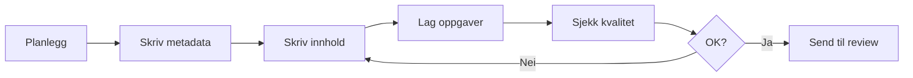

# Forfatterguide for Moduli-konsepter

## 📚 Oversikt

Denne guiden hjelper deg med å skrive pedagogisk sterke og teknisk korrekte konsepter for Moduli. 

## 🎯 Før du starter

### Sjekkliste
- [ ] Har du lest [Quick Start](./quick-start.md)?
- [ ] Har du tilgang til [objektbiblioteket](../reference/objektbibliotek.yaml)?
- [ ] Forstår du de [tre kjerneprinsippene](../README.md#-tre-kjerneprinsipp)?
- [ ] Har du valgt riktig [mal](../templates/)?

## ✍️ Skriveprosessen

### 1. Planlegging (10 min)

#### Definer konseptet
```yaml
# Svar på disse spørsmålene først:
hva:          "Hvilket matematisk objekt handler dette om?"
hvorfor:      "Hvorfor trenger eleven å lære dette?"
når:          "Hvor i progresjonen passer dette?"
hvordan:      "Hvilken tilnærming fungerer best?"
```

#### Identifiser forkunnskaper
- List opp konsepter eleven MÅ kunne
- List opp konsepter som er nyttige
- Sjekk at disse finnes i systemet

### 2. Metadata først (5 min)

Start alltid med metadata:

```yaml
id: "a-3-2"
title: "Lineære funksjoner"
level: 9
strand: algebra

mathematicalObject:
  type: "funksjon"
  represents: "lineær sammenheng"
  properties:
    - "konstant stigningstall"
    - "rett linje som graf"
    - "y = ax + b"

relations:
  requires: ["a-1-1", "a-2-1"]  # variabler, lineære ligninger
  enables: ["a-4-1", "g-3-1"]   # kvadratiske funksjoner, analytisk geometri
```

### 3. Faginnhold (20-40 min)

#### Struktur for innhold.md

```markdown
# [Konsepttittel]

## Innledning
- Start med en **kontekst** eleven kjenner
- Stil et **problem** som motiverer konseptet
- Vis **hvorfor** dette er nyttig

## Kjernekonsept
- **Definer** det matematiske objektet
- **Vis egenskaper** med eksempler
- **Illustrer** med minst 2 representasjoner

## Eksempler
1. **Grunnleggende**: Viser hovedideen
2. **Standard**: Typisk anvendelse
3. **Utvidet**: Kobling til andre konsepter

## Vanlige misforståelser
- ⚠️ **Misforståelse 1**: [Beskrivelse]
  - ✅ **Korreksjon**: [Hvordan rette opp]

## Oppsummering
- Tre hovedpoenger
- Kobling videre
```

#### Språklige retningslinjer

**DO:**
- ✅ Bruk "du" og "vi" - personlig tone
- ✅ Korte setninger og avsnitt
- ✅ Konkrete eksempler før abstraksjon
- ✅ Aktiv stemme: "Vi utforsker..." ikke "Det utforskes..."

**DON'T:**
- ❌ Akademisk sjargong uten forklaring
- ❌ Lange, komplekse setninger
- ❌ "Det er åpenbart at..." - ingenting er åpenbart
- ❌ Hoppe over mellomsteg

### 4. Oppgavebank (15-30 min)

#### Fordeling av oppgavetyper

```yaml
# oppgaver.yaml
metadata:
  konseptId: "a-3-2"
  totalAntall: 20
  fordeling:
    utforskning: 8   # 40%
    øving: 5         # 25%
    kobling: 4       # 20%
    overføring: 3    # 15%

oppgaver:
  utforskning:
    - id: "u1"
      prompt: "Undersøk sammenhengen mellom..."
      hensikt: "Oppdage at stigningstall er konstant"
      hint: "Regn ut endringen i y delt på endringen i x"
      token: "{task:explore}"
```

#### Oppgaveprogresjon

1. **Start konkret**: Tall og kontekst
2. **Generaliser gradvis**: Introduser variabler
3. **Abstraher**: Ren symbolmanipulasjon
4. **Overfør**: Ny kontekst eller kobling

### 5. Differensiering (10 min)

For hvert konsept, planlegg:

#### Støtte (for elever som strever)
```yaml
støtte:
  - type: "visuell"
    beskrivelse: "Bruk grafer og diagrammer"
    eksempel: "Tegn funksjonen før algebraisk manipulasjon"
    
  - type: "prosedyre"
    beskrivelse: "Steg-for-steg oppskrift"
    eksempel: "1. Finn to punkter, 2. Regn stigning..."
```

#### Utvidelse (for elever som vil mer)
```yaml
utvidelse:
  - type: "generalisering"
    beskrivelse: "Utvid til flere variabler"
    eksempel: "Hva om vi har z = ax + by + c?"
    
  - type: "bevis"
    beskrivelse: "Hvorfor fungerer metoden?"
    eksempel: "Bevis at alle lineære funksjoner..."
```

## 📏 Kvalitetskriterier

### Pedagogisk kvalitet
- [ ] **Progresjon**: Fra konkret → abstrakt
- [ ] **Motivasjon**: Tydelig "hvorfor"
- [ ] **Variasjon**: Flere representasjoner
- [ ] **Differensiering**: Støtte og utvidelse

### Teknisk kvalitet
- [ ] **Korrekt matematikk**: Faglig riktig
- [ ] **Konsistent notasjon**: Samme symbolbruk
- [ ] **Riktige tokens**: {var:x}, {expr:2x+1}
- [ ] **Gyldige relasjoner**: Sjekk ID-er

### Språklig kvalitet
- [ ] **Klarhet**: Enkel, presis språkbruk
- [ ] **Engasjement**: Aktiv, personlig tone
- [ ] **Struktur**: Logisk oppbygning
- [ ] **Tilgjengelighet**: Unngår unødvendig sjargong

## 🚀 Arbeidsflyt



## 💡 Tips og triks

### Når du står fast

1. **Gå tilbake til objektet**: Hva er egenskapene?
2. **Tenk elevsyn**: Hva er vanskelig her?
3. **Finn analogi**: Hva ligner dette på?
4. **Forenkle**: Kan du starte enklere?

### Vanlige feil å unngå

1. **For mye på en gang**: Del opp i mindre konsepter
2. **Mangler kontekst**: Start alltid med "hvorfor"
3. **Hopper over steg**: Vis all tenkning
4. **Glemmer differensiering**: Planlegg for mangfold

### Eksempler på god praksis

✅ **God innledning:**
> "Tenk deg at du skal finne ut hvor mye du må betale for taxi. Du vet at startprisen er 50 kr, og så koster det 15 kr per kilometer. Hvordan kan vi beskrive dette matematisk?"

❌ **Dårlig innledning:**
> "En lineær funksjon er en funksjon f(x) = ax + b der a og b er konstanter."

## 📚 Ressurser

- [Matematiske objekter](../reference/objektbibliotek.yaml)
- [Token-referanse](../reference/tokens.yaml)
- [Eksempelkonsept](../templates/eksempel-konsept.md)
- [Reviewer-guide](./reviewer-guide.md)

## ❓ Ofte stilte spørsmål

**Q: Hvor lange skal konseptene være?**
A: Fokuser på kvalitet, ikke lengde. Et godt konsept dekker læringsmålene grundig, typisk 3-5 sider innhold + oppgaver.

**Q: Kan jeg bruke bilder/video?**
A: Ja! Legg dem i `visualiseringer/`-mappen og referer med relative lenker.

**Q: Hvordan håndterer jeg konsepter som overlapper?**
A: Bruk relasjoner aktivt. Henvis til relaterte konsepter heller enn å gjenta.

---

*Lykke til med skrivingen! Husk: Du former fremtidens matematikkforståelse.* 🌟